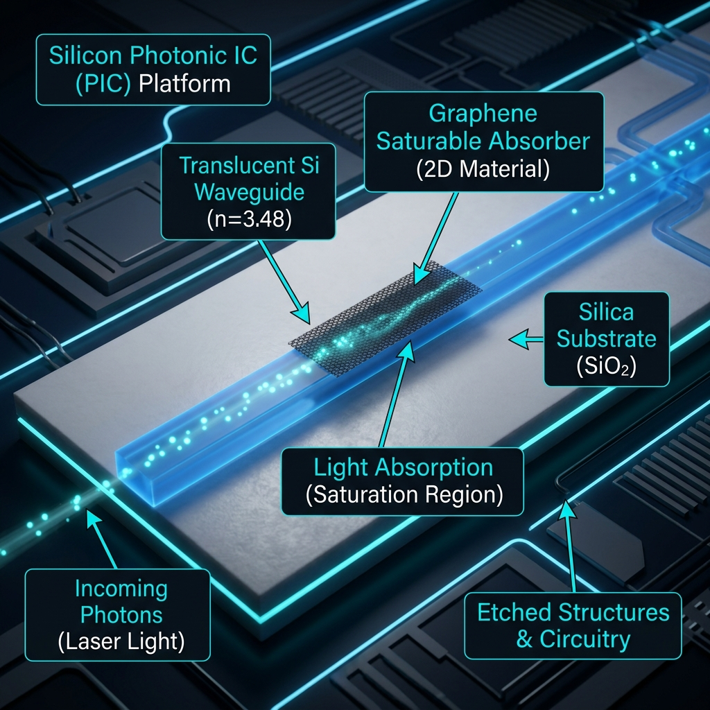
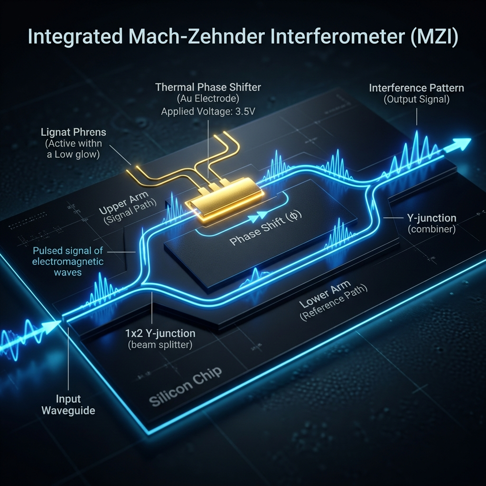
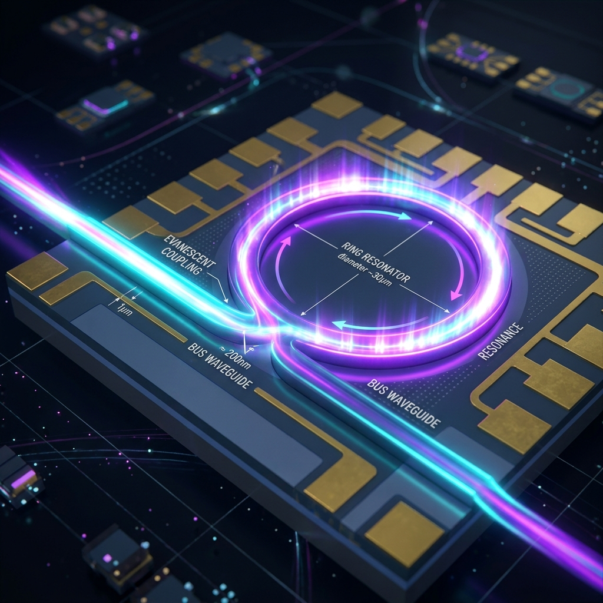
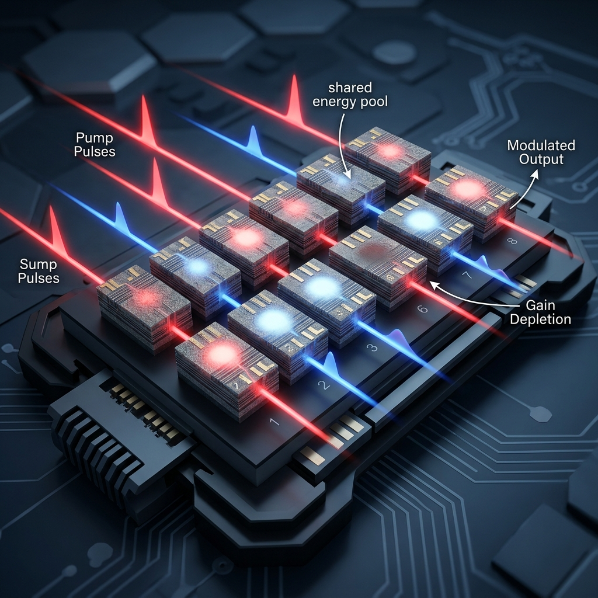

# PHX-PTC ⚡

**Photonic Computing Platform** — A from-scratch C++17 engine that maps GPU architecture and deep learning concepts from binary/electronic logic into photonic (wave-based) logic.

> *Transistors process voltages. Photonic elements process waves.*

<br>

*Quantum Simulator: [PHX-QUANTUM](https://github.com/blackeagle686/phx-quantum)*

## Photonic Hardware Primitives 

PHX-PTC simulates the physical behavior of Silicon Photonic components. These are the building blocks of our optical neural network.

| Component | Function | Visualization |
|---|---|---|
| **Saturable Absorber** | ReLU Activation |  |
| **MZI Modulator** | Sigmoid Activation |  |
| **Ring Resonator** | Tanh Activation |  |
| **SOA Array** | Softmax (XGM) |  |

## Phase 1: Photonic Activation Functions

Maps the 4 foundational neural network activations to their physical optical counterparts:

| Electronic | Photonic | Physical Device |
|---|---|---|
| **ReLU** `max(0,x)` | Saturable Absorber | Intensity thresholding via bleaching |
| **Sigmoid** `1/(1+e⁻ˣ)` | MZI Modulation | cos² interference S-curve |
| **Tanh** | Optical Bistability | Phase-flip non-linearity [-1,+1] |
| **Softmax** | Cross-Gain Modulation | Shared laser gain competition |

## Build

Requires: C++17 compiler (MSVC, GCC, Clang), CMake ≥ 3.20

```powershell
cmake -S . -B build -G "Visual Studio 17 2022" -A x64
cmake --build build --config Release
```

## Run

```powershell
# Full demo with all activations + ASCII transfer curves
.\build\runtime\Release\phx-ptc.exe all

# Individual activation demos
.\build\runtime\Release\phx-ptc.exe relu
.\build\runtime\Release\phx-ptc.exe sigmoid
.\build\runtime\Release\phx-ptc.exe tanh
.\build\runtime\Release\phx-ptc.exe softmax

# Electronic vs Photonic comparison
.\build\runtime\Release\phx-ptc.exe compare

# Photonic neuron example
.\build\examples\Release\photonic_neuron.exe

# Interactive Optical Neural Network layer
.\build\examples\Release\onn_ffn.exe
```

## Test

```powershell
cd build && ctest --output-on-failure -C Release
```

## Architecture

```
phx-ptc/
├── core/           # Wave types — replaces binary voltage signals
│   ├── types.h     # Complex, Intensity, Phase, constants
│   └── wave.h      # Wave (ψ), WaveChannel (WDM)
├── photonic/       # Optical processing elements
│   ├── element.h   # PhotonicElement / MultiChannelElement interfaces
│   ├── relu_sa     # Saturable Absorber (ReLU)
│   ├── sigmoid_mzi # Mach-Zehnder Interferometer (Sigmoid)
│   ├── tanh_bistable # Optical Bistability (Tanh)
│   └── softmax_xgm  # Cross-Gain Modulation (Softmax)
├── runtime/        # CLI with ASCII transfer curves
├── tests/          # 5 test suites (50+ test cases)
└── examples/       # Photonic neuron demo
```

## Roadmap

- [x] **Phase 1** — Photonic Activation Functions
- [ ] **Phase 2** — MZI Mesh Linear Transform (replaces nn.Linear)
- [ ] **Phase 3** — Photonic Processing Element (PPE)
- [ ] **Phase 4** — Photonic Core & Kernel Abstraction
- [ ] **Phase 5** — Hybrid integration with phx-quantum [PHX-QUANTUM](https://github.com/blackeagle686/phx-quantum)

## Zero Dependencies

Built entirely from scratch in C++17. No Eigen, no Boost, no external libraries.

## License

MIT
